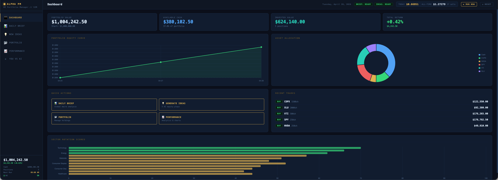
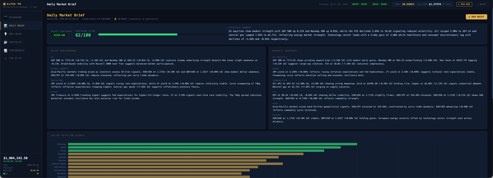
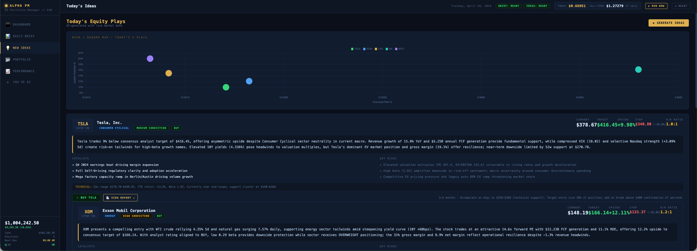
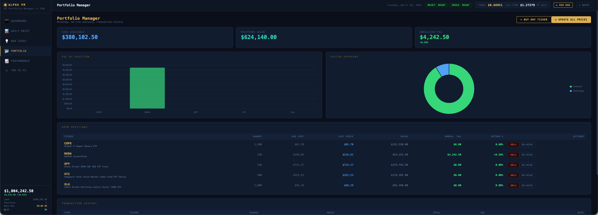
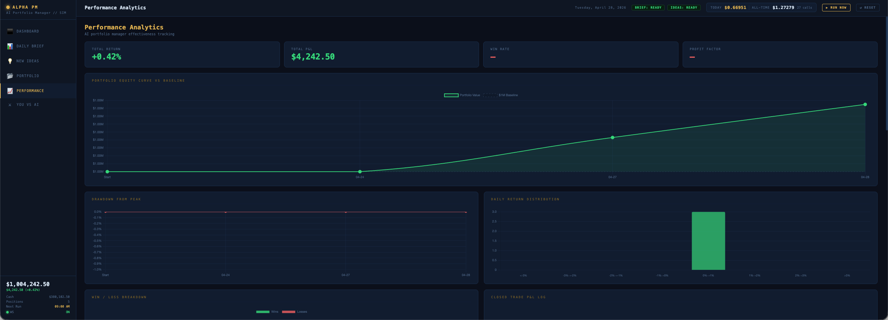
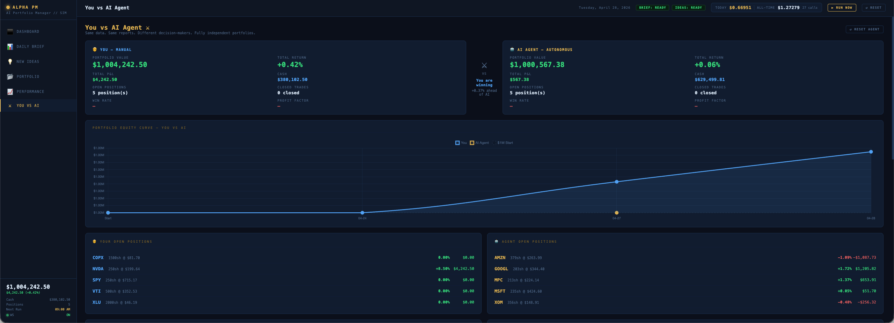
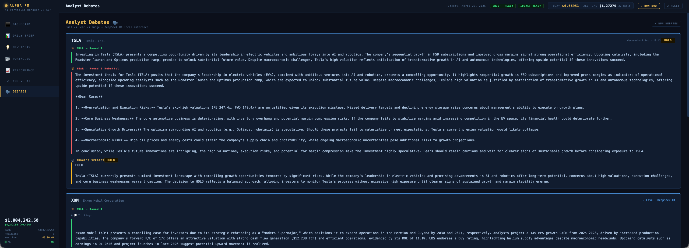

<div align="center">
  
  <h1>Alpha PM — AI Portfolio Manager</h1>
  <p>An AI-powered portfolio manager running a daily pipeline of market briefs, equity research, and autonomous investment decisions.</p>
  <p>Built with <strong>Claude Haiku</strong> (Anthropic API) · <strong>yfinance</strong> (real market data) · <strong>Web Search</strong> · <strong>DeepSeek R1</strong> (local Ollama debates)</p>
</div>

---

## How the Pipeline Works

```
yfinance  ──→  Live prices, fundamentals, 52w range, margins, analyst targets
RSS feeds ──→  Headlines (Yahoo Finance, MarketWatch, CNBC)
Web search──→  Latest earnings, analyst upgrades, breaking news (reports & de-risk)
              │
              ▼
     Step 1 — Daily Brief
     Market context: sentiment score, macro themes, sector rotation stances
              │
              ▼
     Step 2 — Equity Plays  (brief-informed)
     5 tickers nominated and researched using today's macro view
              │
              ▼
     Step 3 — Research Reports  (auto, all 5 plays)
     Full equity research with web search for latest news
              │
              ▼
     Step 4 — Human Portfolio De-risk
     Fresh yfinance + web search analysis on every open position
              │
              ▼
     Step 5 — AI Agent Pipeline
     Autonomous BUY/PASS on new plays + HOLD/REDUCE/EXIT on existing positions
              │
              ▼
     Step 6 — Analyst Debate  (local, free, optional)
     DeepSeek R1 14B runs a 2-round bull vs bear debate per stock
     Bull R1 → Bear R1 rebuttal → Bull R2 counter → Bear R2 final → Judge verdict
```

No hallucinated prices — all stock data comes from yfinance directly.

---

## Requirements

- Python 3.11+
- An **Anthropic API key** (`sk-ant-...`)
- **Ollama** with `deepseek-r1:14b` pulled — required only for the debate feature (`DEBATE_ENABLED = True` in `debate.py`)

---

## Quick Start

```bash
cd ClaudePortfolioManager
chmod +x run.sh
./run.sh
```

The script will prompt for your API key if `ANTHROPIC_API_KEY` is not set.  
Browser opens automatically at **http://localhost:8000**.

To set the key permanently:
```bash
echo 'export ANTHROPIC_API_KEY=sk-ant-...' >> ~/.zshrc
```

---

## Cost

Uses **Claude Haiku** — the most cost-efficient Claude model.

| Item | Estimated cost |
|---|---|
| Full daily pipeline (brief + 5 plays + 5 reports + de-risk + agent) | ~$0.50–0.80 |
| Brief only | ~$0.02 |
| Per research report (with web search) | ~$0.05–0.10 |
| Analyst debates (DeepSeek R1 via Ollama) | **$0.00** — runs locally |

Live cost tracking is displayed in the UI and logged to the terminal for every API call.

---

## Screenshots

### Dashboard

*Portfolio equity curve, asset allocation, sector rotation scores, quick actions, and recent trades — all in one view.*

### Daily Market Brief

*Sentiment score, macro outlook, sector rotation stances, key themes, risk factors, and upcoming catalysts — generated fresh every weekday at 9 AM.*

### Equity Plays

*5 brief-informed stock ideas plotted on a risk/reward chart, each with a full thesis, catalysts, and stop-loss built from real yfinance data.*

### Portfolio Manager

*Holdings with live prices, unrealised P&L per position, sector exposure donut, and full transaction history.*

### Performance Analytics

*Equity curve vs $1M baseline, drawdown from peak, daily return distribution, and win/loss breakdown.*

### You vs AI Agent

*Side-by-side comparison of your portfolio against the autonomous AI agent — same data, independent decisions.*

### Analyst Debates

*Two-round bull vs bear debate per stock streamed live from DeepSeek R1 14B running locally. Tokens print in real time with a collapsible thinking section. Judge reads all four turns before issuing a BUY / HOLD / PASS verdict.*

---

## Features

### 📊 Daily Market Brief  *(auto at 9:00 AM, weekdays only)*
- Fetches live prices for indices (S&P 500, Nasdaq, Dow, Russell, VIX, 10Y/2Y yields), commodities (Gold, Oil, Copper, Silver, Nat Gas), FX (DXY, EUR/USD, USD/JPY, USD/SGD, GBP/USD, AUD/USD), crypto (BTC, ETH), and all 11 sector ETFs
- Pulls headlines from Yahoo Finance, MarketWatch, CNBC
- Claude analyses real data → executive summary, macro outlook, sentiment score (0–100), sector rotation stances (overweight/neutral/underweight with scores), key themes, risk factors, upcoming catalysts

### 💡 Equity Plays  *(5 brief-informed ideas)*
1. Claude nominates 5 tickers aligned with today's macro view — favouring overweight sectors, avoiding underweight
2. yfinance fetches real fundamentals for each: P/E, forward P/E, EV/EBITDA, P/B, revenue TTM, margins, growth rates, ROE, FCF, analyst targets, 52w range, YTD return, beta
3. Claude writes a thesis citing the actual numbers and the day's macro context, with catalysts, risks, target price, and stop-loss

### 📄 Research Reports  *(auto-generated for all 5 plays)*
- Full equity research note per ticker, generated with web search for latest earnings, analyst upgrades/downgrades, and news
- Includes scenario analysis (bull/base/bear), valuation methods, competitive position, and a decision framework (buy if / pass if / watch)

### ⚡ De-risk Analysis
- On-demand (click per position) or auto-run daily for all human positions
- Fetches fresh yfinance data + web search for latest news
- Returns recommendation (HOLD/REDUCE/EXIT), updated target and stop-loss, key developments, and a specific action with price levels

### 🤖 AI Agent Portfolio
- Completely autonomous portfolio running in parallel to the human portfolio
- Reviews each research report and decides BUY or PASS
- Position sizing: standard 10%, high-conviction 15%, always keeps ≥20% cash
- Maximum 8 concurrent positions
- Daily de-risk on every agent position with automatic enforcement of:
  - Hard stop-loss: EXIT if down ≥10%
  - Profit-taking: REDUCE 40% if up ≥25%
  - Second-pass review for HOLD outcomes (can also ADD or REDUCE)

### 📡 Live Price Updates
- Polls all held tickers (human + agent combined) every 5 minutes
- Market-hours gated — only polls when the relevant exchange is open:
  - SGX: 09:00–17:00 SGT
  - HKEX: 09:30–16:00 SGT
  - US: 21:30–04:00 SGT (spans midnight)
- Updates pushed to the browser via WebSocket in real time

### 📂 Portfolio Manager
- Buy/sell with average cost basis tracking
- Unrealised P&L per position, live price feed
- Sector exposure donut chart, P&L bar chart

### 📈 Performance Analytics
- Equity curve vs $1M baseline
- Drawdown from peak chart
- Daily return distribution histogram
- Win/loss breakdown, profit factor, trade history

### ⚔️ You vs AI Agent
- Side-by-side comparison of human and agent portfolio performance
- Combined equity curve overlay
- Agent decision log with full reasoning for every trade

### 🗣 Analyst Debates  *(local, free — requires Ollama)*
- Runs automatically after the daily pipeline, or on-demand via the Debates tab
- Two-round structured debate per stock using **DeepSeek R1 14B** running locally via Ollama
  1. **Bull R1** — opening investment case with specific numbers
  2. **Bear R1** — direct rebuttal to the bull's argument
  3. **Bull R2** — counter to the bear's rebuttal
  4. **Bear R2** — final closing bear argument
  5. **Judge** — reads all four turns and issues a BUY / HOLD / PASS verdict
- Streams live token-by-token in the browser (with a collapsible thinking section for DeepSeek R1's `<think>` reasoning)
- Toggle with `DEBATE_ENABLED = True/False` in `debate.py`
- Zero API cost — runs entirely on your local machine

---

## Scheduling

| Condition | Behaviour |
|---|---|
| Weekday, started before 9 AM | Waits; runs at exactly 09:00 SGT |
| Weekday, started after 9 AM, no data yet | Catch-up run triggers immediately |
| Weekday, started after 9 AM, data exists | Nothing; next run tomorrow |
| **Every weekday at 09:00** | Full pipeline: brief → plays → reports → de-risk → agent |
| Saturday / Sunday | Pipeline skipped entirely |

If the browser tab was open during the pipeline and missed the completion event, the UI catches up automatically within 30 seconds via status polling.

---

## File Structure

```
ClaudePortfolioManager/
├── code/
│   ├── main.py           # FastAPI backend, pipeline, AI agent, scheduler
│   ├── database.py       # SQLite layer (all reads/writes)
│   ├── debate.py         # Analyst debate pipeline (DeepSeek R1 via local Ollama)
│   ├── requirements.txt
│   └── static/
│       └── index.html    # Frontend (Bloomberg-style dark UI, Chart.js)
├── data/
│   └── alpha_pm.db       # SQLite database (briefs, plays, reports, portfolios, costs)
├── assets/               # Screenshots and icon
├── run.sh                # One-command launcher
├── Dockerfile            # For cloud deployment
├── fly.toml              # Fly.io config (Singapore region, persistent volume)
└── README.md
```

---

## Troubleshooting

**Rate limited (429)**  
The app auto-retries with exponential backoff (waits 65s → 90s → 120s). No action needed — you'll see a warning in the terminal and a notification in the UI.

**Report shows "Could not parse report JSON"**  
Claude occasionally adds a preamble before the JSON when using web search. The system prompt is set to prevent this. If it persists, the report is skipped and the pipeline continues with the remaining plays.

**Brief generated but not showing in browser**  
Refresh the page — the UI re-fetches from the API on load and the brief tab will populate within a few seconds.

**yfinance returns no data or stale prices**  
Occasionally happens on weekends or around market holidays. The last known close is used. Wait and retry.

**"ANTHROPIC_API_KEY not set"**  
Set the key in your shell:
```bash
export ANTHROPIC_API_KEY=sk-ant-...
```
Or pass it directly: `ANTHROPIC_API_KEY=sk-ant-... ./run.sh`

---

*FastAPI · APScheduler · Claude Haiku · Anthropic Web Search · yfinance · feedparser · Chart.js · SQLite · Ollama · DeepSeek R1*
